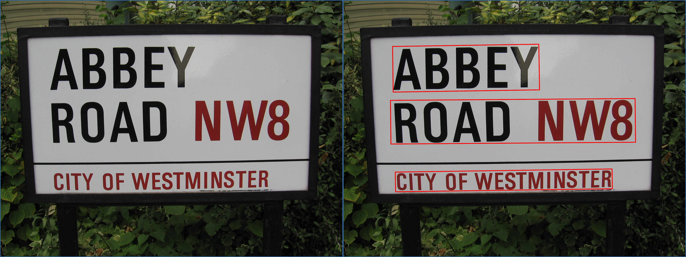

Example Workflows Using azcv
============================

Examples of embedding the azcv commands within a Unix/Linux pipeline.


How Many Tags Identified in an Image
------------------------------------

```console
$ ml tag azcv img.png | wc -l
```

Mark up Bounding Boxes for Text in Image
----------------------------------------

In this example the bounding boxes are captured into the text
file and then drawn on to a copy of the image.

```console
$ ml ocr azcv img.jpg > img_bb.txt

$ cat img_bb.txt |
  cut -d']' -f1 |
  tr -d '[,' |
  xargs printf '-draw "polygon %s,%s %s,%s %s,%s %s,%s" ' |
  awk '{print "img.jpg -fill none -stroke red " $0 "img_bb.jpg"}' |
  xargs convert
  
$ montage -background '#336699' -geometry +4+4 img.jpg img_bb.jpg montage.jpg

$ eog montage.jpg
```

Here's the result for the Abbey Road sign post:



Add Text to the Image
---------------------

Starting with the bounding box marked up image, we can add the
identified text to each box.

```console
$ cat img_bb.txt |
  tr -d '[],' | 
  cut -d' ' -f1,2,9- | 
  perl -pe 's|(\d+) (\d+) (.+)|-annotate +\1+\2 \\"\3\\"|' | 
  xargs | 
  awk '{print "img_bb.jpg -pointsize 50 " $0 " img_bb_text.jpg"}' | 
  xargs convert

$ montage -background '#336699' -geometry +4+4 img.jpg img_bb_text.jpg montage.jpg

$ eog montage.jpg
```


