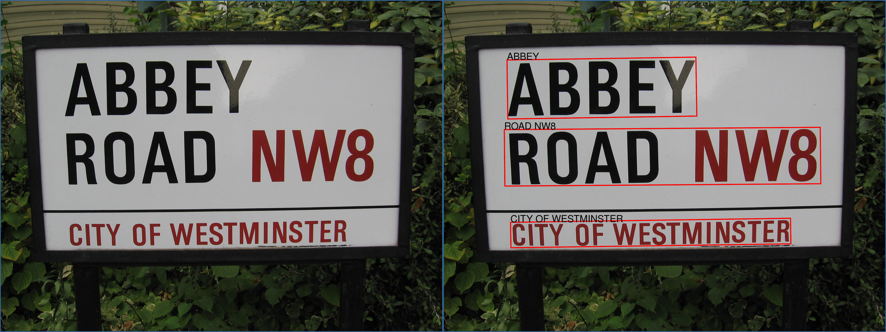

Example Workflows Using azcv
============================

Examples of embedding the azcv commands within a Unix/Linux pipeline.


*How Many Tags Identified in an Image*

```console
$ ml tag azcv img.jpg | wc -l
6
```
*How Many High Confidence Tags Identified*

```console
$ ml tag azcv img.jpg | awk '$1 > 0.90 {print}' | wc -l
5
```

*Identify Tags from a Folder of Images*

```console
$ for f in *.jpg; do echo ==== $f ====; ml tag azcv $f; done
==== 20190610_133243.jpg ====
1.00,indoor
0.99,furniture
0.95,bathroom
0.90,design
0.75,sink
0.61,drawer
0.60,home appliance
==== 20190610_143537.jpg ====
0.94,screenshot
0.92,book
0.91,poster
0.88,indoor
0.63,art
0.59,mobile phone
[...]
```

*Mark up Bounding Boxes for Text in Image*

In this example the bounding boxes are captured into the text
file and then drawn on to a copy of the image.

```console
$ ml ocr azcv img.jpg > img_bb.txt

$ cat img_bb.txt |
  cut -d',' -f1 |
  xargs printf '-draw "polygon %s,%s %s,%s %s,%s %s,%s" ' |
  awk '{print "img.jpg -fill none -stroke red -strokewidth 5 " $0 "img_bb.jpg"}' |
  xargs convert
  
$ montage -background '#336699' -geometry +4+4 img.jpg img_bb.jpg montage.jpg

$ eog montage.jpg
```

Here's the result for the Abbey Road sign post:


*Add Text to the Image*

Starting with the bounding box marked up image, we can add the
identified text to each box.

```console
$ cat img_bb.txt |
  tr -d ',' ' '| 
  cut -d' ' -f1,2,9- | 
  perl -pe 's|(\d+) (\d+) (.+)|-annotate +\1+\2 \\"\3\\"|' | 
  xargs | 
  awk '{print "img_bb.jpg -pointsize 50 " $0 " img_bb_text.jpg"}' | 
  xargs convert

$ montage -background '#336699' -geometry +4+4 img.jpg img_bb_text.jpg montage.jpg

$ eog montage.jpg
```


